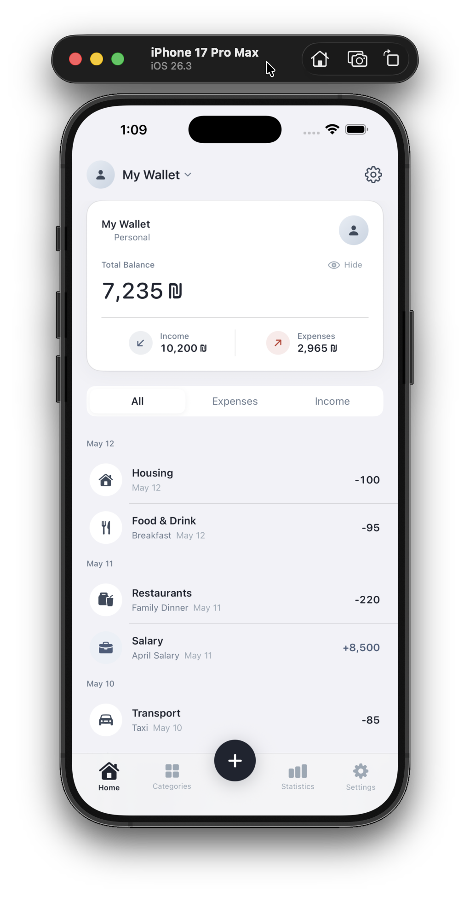
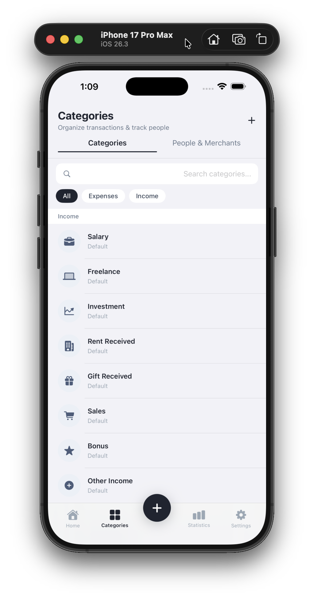
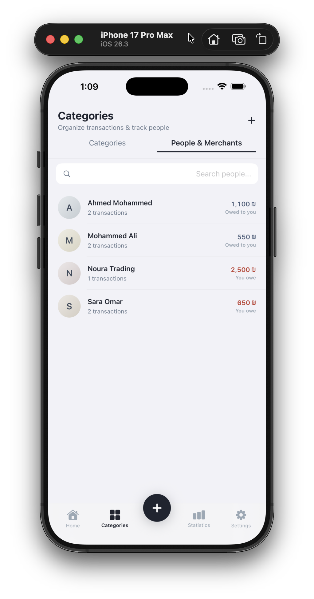
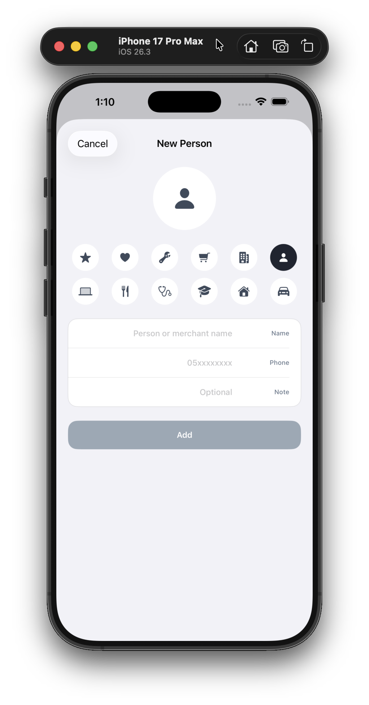
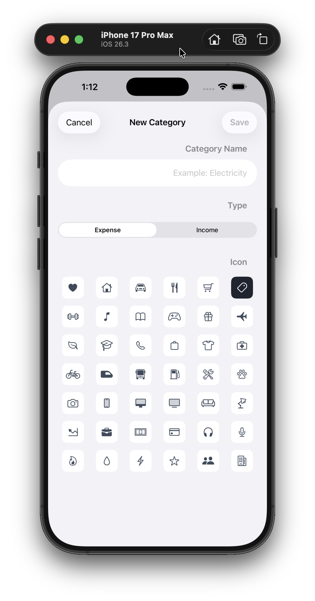
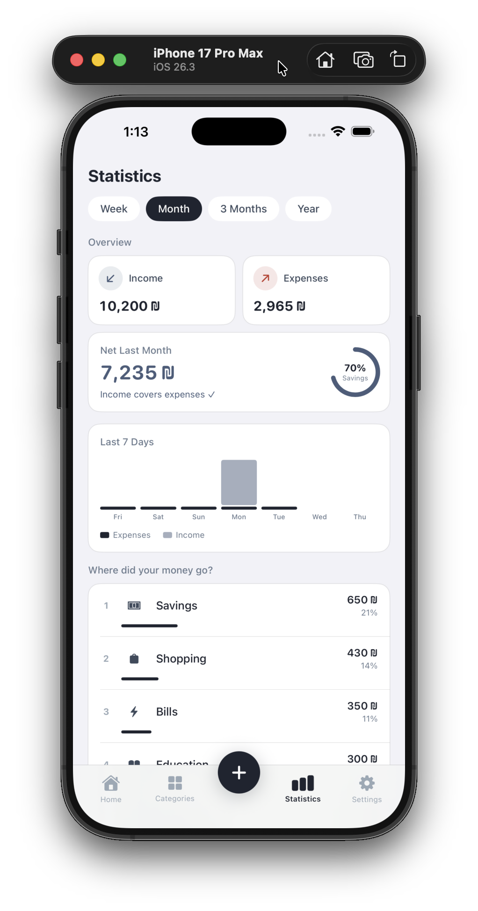
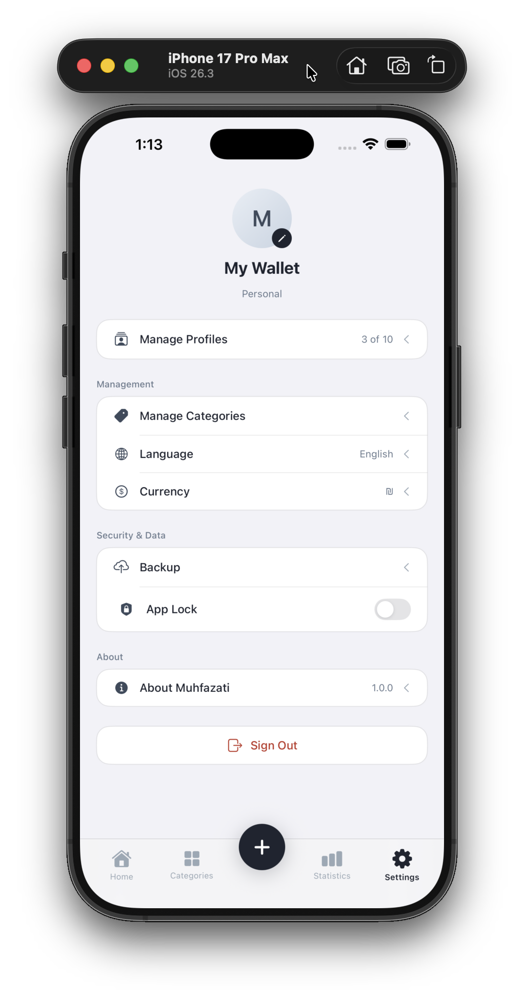
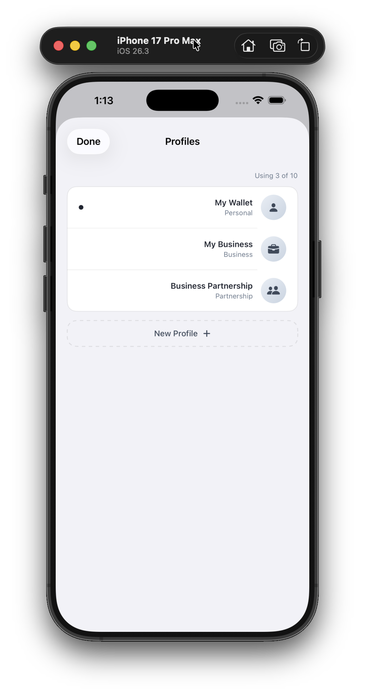
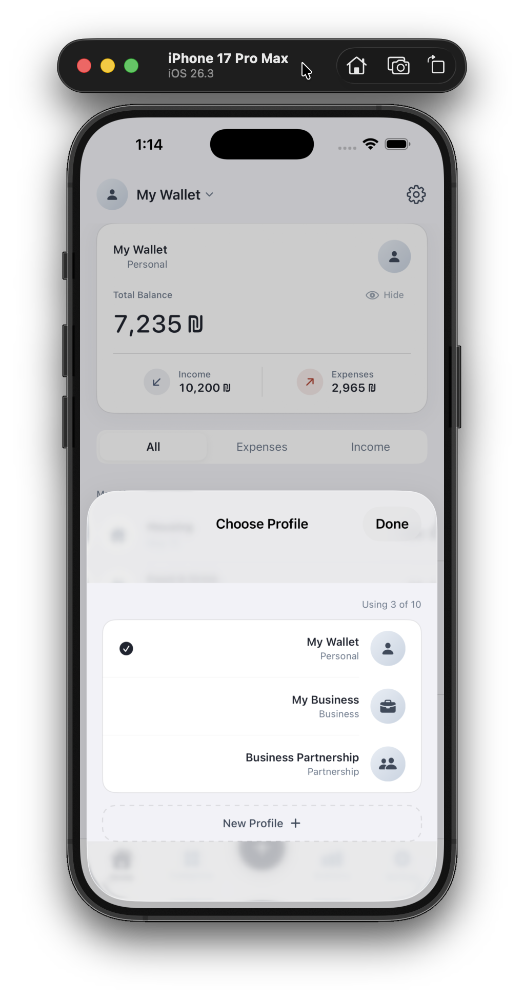

# Muhfazati — Personal Finance Manager

A personal expense tracking iOS app built with SwiftUI and SwiftData.

---

## Screenshots

| Dashboard | Categories | People & Merchants |
|:---:|:---:|:---:|
|  |  |  |

| Add Person | Add Category | Statistics |
|:---:|:---:|:---:|
|  |  |  |

| Settings | Manage Profiles | Switch Profile |
|:---:|:---:|:---:|
|  |  |  |

---

## Features

### Wallet Management
- Multiple wallet types: Personal, Business, Partnership, Family
- Create and switch between multiple wallets easily
- Customize name, color, and currency symbol for each wallet

### Transaction Tracking
- Quickly log income and expenses
- Categorize each transaction with a custom category
- Add notes to transactions
- Support for multiple currency symbols (₪ / SAR / $ and more)

### Categories
- Built-in default categories for both income and expenses
- Create custom categories with SF Symbol icons
- Edit and delete categories freely

### People & Debt Ledger
- Track loans and debts with individuals
- Know who owes you and who you owe
- Settle debts and view full transaction history per person

### Statistics
- Monthly and daily summaries of income and expenses
- Clear charts to understand spending patterns
- Income vs. expenses comparison per period

### UI & Design
- Full Arabic language support with RTL layout
- Clean, consistent light mode design
- Smooth animations and transitions throughout the app
- Interactive balance card on the home screen

---

## Requirements

| Requirement | Version |
|---|---|
| iOS | 17.0+ |
| Xcode | 15.0+ |
| Swift | 5.9+ |

---

## Technologies

| Technology | Usage |
|---|---|
| SwiftUI | User interface |
| SwiftData | Local database |
| SF Symbols | Icons |

---

## Project Structure

```
Muhfazati/
├── Models/           # SwiftData models (Profile, Transaction, Category, Person)
├── Views/
│   ├── Dashboard/    # Home screen + WalletCard
│   ├── Transactions/ # Add transactions
│   ├── Categories/   # Categories and detail views
│   ├── People/       # People and debt tracking
│   ├── Statistics/   # Statistics and charts
│   ├── Settings/     # Settings and wallet management
│   ├── Root/         # Main tab bar
│   └── Shared/       # Reusable components
├── Theme/            # Colors and fonts
└── Utilities/        # Helper utilities
```

---

## Installation

```bash
git clone https://github.com/aboashraf169/Muhfazati.git
cd Muhfazati
open Muhfazati.xcodeproj
```

Select a simulator or device running iOS 17+ and press **⌘R** to run.
